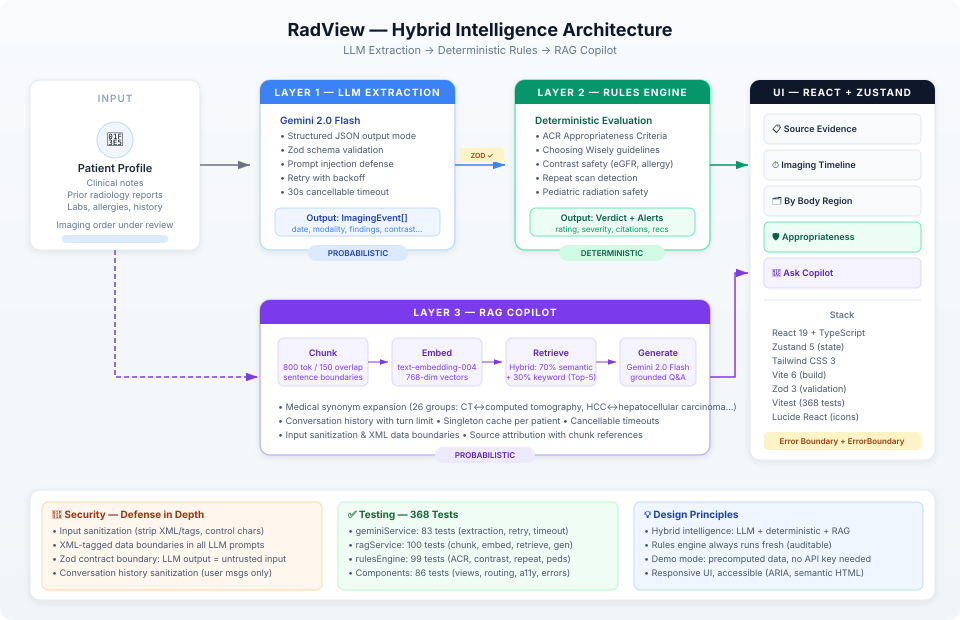

# RadView

**Radiology Imaging Decision Support System**

RadView is a clinical decision support tool that helps radiologists evaluate imaging orders against evidence-based guidelines. It combines LLM-powered data extraction, a deterministic rules engine, and a RAG-based copilot into a single workflow — demonstrating a hybrid intelligence pattern where each layer plays to its strengths.

<p align="center">
  
</p>

## How It Works

RadView processes a patient's clinical record through three layers:

**Layer 1 — LLM Extraction.** Clinical notes and prior radiology reports are sent to Gemini 2.0 Flash, which extracts structured imaging events (date, modality, body region, contrast, findings, etc.) using JSON Schema enforcement. The output is validated at a Zod contract boundary before entering the next layer — treating all LLM output as untrusted input.

**Layer 2 — Deterministic Rules Engine.** The extracted imaging history and the current order are evaluated against a rule set drawn from ACR Appropriateness Criteria, Choosing Wisely recommendations, contrast safety guidelines (eGFR thresholds, allergy checks, pregnancy status), Fleischner Society lung nodule follow-up criteria, and pediatric radiation safety (Image Gently). This layer is entirely deterministic — no LLM calls, fully auditable, with every alert linked to a citation.

**Layer 3 — RAG Copilot.** A conversational Q&A interface grounded in the patient's actual records. Documents are chunked with sentence-boundary awareness, embedded via `text-embedding-004`, and retrieved using hybrid scoring (70% semantic similarity + 30% keyword with medical synonym expansion across 26 clinical term groups). Responses are generated by Gemini 2.0 Flash with source attribution.

## Architecture

```
Patient Data ──► LLM Extraction ──[Zod]──► Rules Engine ──► Verdict + Alerts
                  (probabilistic)           (deterministic)
                       │
                       ▼
                   RAG Copilot ──► Grounded Q&A with source citations
                  (probabilistic)
```

The key design insight is **separation of concerns by reliability requirement**: probabilistic layers handle unstructured-to-structured conversion and natural language Q&A, while the safety-critical appropriateness evaluation remains fully deterministic and auditable.

## Demo Patients

RadView ships with four precomputed patient profiles — no API key required to explore the full workflow:

| Patient | Scenario | Rules Triggered |
|---------|----------|-----------------|
| Mrs. Li-Mei Zhang | Repeat CT scan, CKD Stage 3b | Repeat scan detection, contrast safety (low eGFR) |
| Mr. Arjun Patel | Low-back pain, young adult | Choosing Wisely (early imaging), appropriateness criteria |
| Ms. Sofia Rivera | Pregnant, abdominal pain | Pregnancy contrast contraindication, radiation safety |
| Mr. Tomasz Kowalski | Pediatric, lung nodule follow-up | Image Gently (pediatric dose), Fleischner criteria |

## Tech Stack

| Layer | Technology |
|-------|-----------|
| Framework | React 19 + TypeScript (strict mode) |
| State | Zustand 5 |
| Styling | Tailwind CSS 3 |
| Build | Vite 6 |
| Validation | Zod 3 |
| LLM | Google Generative AI SDK (`@google/generative-ai`) |
| Testing | Vitest — 368 tests (282 service + 86 component) |
| Icons | Lucide React |

## Project Structure

```
src/
├── App.tsx                          # Root layout + ViewRouter
├── types.ts                         # Core type system + Zod schemas
├── components/
│   ├── common/ErrorBoundary.tsx      # Crash recovery UI
│   ├── layout/
│   │   ├── Header.tsx                # App header
│   │   └── Sidebar.tsx               # Patient selector + nav
│   └── views/
│       ├── SourceEvidenceView.tsx     # Raw clinical notes + reports
│       ├── ImagingTimelineView.tsx    # Chronological imaging history
│       ├── BodyRegionView.tsx         # Imaging grouped by anatomy
│       ├── AppropriatenessView.tsx    # Verdict banner + alert cards
│       └── CopilotView.tsx           # RAG chat interface
├── data/
│   ├── patients.ts                   # 4 demo patient profiles
│   └── precomputed.ts                # Pre-extracted events (no API key needed)
├── services/
│   ├── geminiService.ts              # LLM extraction + pipeline orchestration
│   ├── rulesEngine.ts                # Deterministic appropriateness evaluation
│   ├── ragService.ts                 # RAG copilot (chunk → embed → retrieve → generate)
│   ├── geminiService.test.ts         # 83 tests
│   ├── rulesEngine.test.ts           # 99 tests
│   └── ragService.test.ts            # 100 tests
├── store/useAppStore.ts              # Zustand global state
└── utils/constants.ts                # Shared constants + date helpers
```

## Getting Started

```bash
# Install dependencies
npm install

# Start dev server (demo patients work without an API key)
npm run dev

# Run tests
npm test

# Type check
npm run typecheck

# Production build
npm run build
```

### Live Extraction (Optional)

To use live LLM extraction with non-demo patients, create a `.env` file:

```
VITE_GEMINI_API_KEY=your_api_key_here
```

Get an API key from [Google AI Studio](https://aistudio.google.com/apikey). Demo patients use precomputed data and work without a key.

## Security Model

RadView treats LLM output as untrusted input throughout:

- **Input sanitization** strips XML-like tags, control characters, and potential prompt injection patterns from all patient data before it reaches any LLM prompt.
- **XML data boundaries** (`<CLINICAL_DATA>`, `<RADIOLOGY_REPORTS>`) separate trusted instructions from untrusted patient content in prompts.
- **Zod validation** at the contract boundary ensures only well-typed, structurally valid data enters the deterministic rules engine.
- **Conversation history sanitization** applies only to user messages — assistant messages pass through unsanitized to preserve legitimate clinical text.
- **Cancellable timeouts** in both the extraction and RAG services prevent timer leaks when API calls resolve before the timeout fires.

## Testing

368 tests cover both the service layer and UI components:

- **geminiService** (83 tests) — prompt construction, JSON cleaning, event normalization, Zod validation, retry logic, error mapping, timeout behavior, precomputed data path
- **rulesEngine** (99 tests) — ACR criteria matching, contrast safety checks, repeat scan detection, pediatric rules, severity calculation, verdict aggregation, edge cases
- **ragService** (100 tests) — chunking with sentence boundaries, synonym expansion, hybrid scoring, embedding batching, generation prompt construction, conversation history, singleton caching, cancellable timeouts
- **Component tests** (86 tests) — ViewRouter switching, AppropriatenessView verdict/alerts/badges, CopilotView chat flow/errors/source pills, Sidebar navigation/accessibility, SourceEvidenceView empty states, ImagingTimelineView/BodyRegionView rendering, ErrorBoundary recovery

```bash
npm test              # Run all tests
npm run test:watch    # Watch mode
npm run test:coverage # Coverage report
```

## License

MIT
